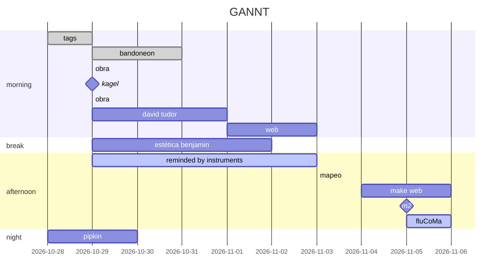

WEB

[https://dipaola-c.github.io/estadosmaquinotimbricos/](https://dipaola-c.github.io/estadosmaquinotimbricos/)

![[Pasted image 20241009132605.png]]
#### Research
- [x] Essays and Papers
- [x] Music 2.0 (Assis)
- [x] Curso Orpheus Institute in Ghent https://www.edx.org/learn/music-arts/ku-leuven-artistic-research-in-music-an-introduction
- [x] The Artistic Turn
- [x] Research in art and design
- [x] Method, methodology and research design in artistic research - Húbner
- [x] Índice tentativo

##### Objetivos
1. Poder exponer el tema de tesis en 10/20 minutos ante quien corresponda y tener en cuenta las fuentes propuestas y las recomendadas posteriormente (consultar con una propuesta contundente aunque pueda ser modificable/enriquecida)
###### Decide if you're done
1. listar los tópicos (preguntas, facts) para la tesis
2. listar los tópicos que podrían soportar la hipótesis personal 
3. si se puede atribuir dos fuentes a cada uno de los tópicos del paso 1, y una buena fuente para la mayoría de los tópicos en paso 2, pasar al siguiente paso, de lo contrario, seguir en la búsqueda
#### Tema
- Definir temática/s tentativa/s
	- Moduladores instrumentales externos
	- Similitud tímbrica entre moduladores humanos y artificiales
		- Posible estructura
			- capitulo 1 similitud
			- capitulo 2 timbre
			- capitulo 3 moduladores
			- capitulo 4 humanos
			- capitulo 5 artificiales
- Realizar análisis de la obra hasta el momento
- Cambios tentativos de la obra
- Granular, mosaico tímbrico, timbre y forma, forma tímbrica
	- Herramienta de análisis (flucoma)
###### Tareas
- [ ] investigar: ![[Pasted image 20231010225524.png]]

---
##### Tutoría
- [ ] Processus (definir)
- [ ] Principio de excitación separada y modelización de la resonancia - resonadores
- [ ] Estado tímbrico (definición)
- [ ] Binomio humano-máquina
- [ ] James Tenney
---
- [x] Web estados maquínicos
- [ ] Completar cuadro estados maquínicos (ver tabla Ruviario)
- [ ] Estudiar Tudor
	- [ ] Analizar Tudor
- [ ] Analizar Kagel
	- [ ] The Buttons on Pandora’s Box: David Tudor and the Bandoneon
- [ ] Experimenting the human - Douglas Barett (n3 - 456)
- [ ] Espacio tímbrico - Wessel
- [ ] Estudios tímbricos - Riera
- [ ] Castro
- [ ] Robotic musicianship - Gil Weinberg, Mason Bretan, Guy Hoffman, Scott Driscoll
- [ ] Curtis Roads - Microsound
- [ ] Reminded by the instruments - Nakai
	- [ ] Open Sources: Words, Circuits, and the Notation/Realization Relation in the Music of David Tudor
	- [ ] Recital Hall of Cruelty: Antonin Artaud, David Tudor, and the 1950s Avant-Garde
	- [ ] David Tudor and the Performance of American Experimental Music **(no lo encontré!)**
	- [ ] David Tudor’s Rainforest: An Evolving Exploration of Resonance
	- [ ] IDEA AND COMMUNITY: THE GROWTH OF DAVID TUDOR'S RAINFOREST, 1965-2006 - Matthew R. Rogalsky
- Teodorescu-Ciocanea, L. (2022). Poetics of Hypertimbralism in music. Proceedings of the European Academy of Sciences & Arts, Vol. 1, No 1, pp. 1-20
- Herold, N. (2012). Timbre et analyse musicale : les possibilités d’intégration du timbre dans l’analyse formelle des œuvres pour piano du dix-neuvième siècle.

https://www.getty.edu/research/tools/guides_bibliographies/david_tudor/resources.html (más biblio específica sobre Tudor)

[https://www.jstor.org/stable/25164662?read-now=1&seq=1#page_scan_tab_contents](https://www.jstor.org/stable/25164662?read-now=1&seq=1#page_scan_tab_contents) (VER MAS DE TUDOR)

[https://davidtudor.org/](https://davidtudor.org/) (TUDOR)

[https://www.google.com/search?q=Alvin+Lucier%2C+%E2%80%9CRemembering+David+Tudor&oq=Alvin+Lucier%2C+%E2%80%9CRemembering+David+Tudor&gs_lcrp=EgZjaHJvbWUyBggAEEUYOdIBBzI4M2owajeoAgCwAgA&sourceid=chrome&ie=UTF-8](https://www.google.com/search?q=Alvin+Lucier%2C+%E2%80%9CRemembering+David+Tudor&oq=Alvin+Lucier%2C+%E2%80%9CRemembering+David+Tudor&gs_lcrp=EgZjaHJvbWUyBggAEEUYOdIBBzI4M2owajeoAgCwAgA&sourceid=chrome&ie=UTF-8) (PAPER LUCIER DE TUDOR)
[https://www.redbullmusicacademy.com/lectures/alvin-lucier-lecture](https://www.redbullmusicacademy.com/lectures/alvin-lucier-lecture)

[https://www.vice.com/en/article/nz83j7/alvin-lucier-has-found-the-music-in-the-world-around-him-for-more-than-50-years](https://www.vice.com/en/article/nz83j7/alvin-lucier-has-found-the-music-in-the-world-around-him-for-more-than-50-years)

[https://www.getty.edu/research/tools/guides_bibliographies/david_tudor/resources.html](https://www.getty.edu/research/tools/guides_bibliographies/david_tudor/resources.html) (VER BIBLIOGRAFIA!!!!)

[https://core.ac.uk/download/pdf/42628585.pdf](https://core.ac.uk/download/pdf/42628585.pdf) (TESIS LEER!!)
[https://www.getty.edu/research/exhibitions_events/events/david_tudor_symposium/pdf/driscollrogalsky.pdf](https://www.getty.edu/research/exhibitions_events/events/david_tudor_symposium/pdf/driscollrogalsky.pdf)
[https://www.getty.edu/research/exhibitions_events/events/david_tudor_symposium/pdf/kuivila.pdf](https://www.getty.edu/research/exhibitions_events/events/david_tudor_symposium/pdf/kuivila.pdf)

[https://www.google.com/search?q=Pepscillator+david+tudor&oq=Pepscillator+david+tudor&gs_lcrp=EgZjaHJvbWUyBggAEEUYOTIHCAEQIRigATIHCAIQIRigAdIBCDE5NDlqMGo3qAIAsAIA&sourceid=chrome&ie=UTF-8](https://www.google.com/search?q=Pepscillator+david+tudor&oq=Pepscillator+david+tudor&gs_lcrp=EgZjaHJvbWUyBggAEEUYOTIHCAEQIRigATIHCAIQIRigAdIBCDE5NDlqMGo3qAIAsAIA&sourceid=chrome&ie=UTF-8)

[http://remindedbytheinstruments.info/matrixmapdiagram.html](http://remindedbytheinstruments.info/matrixmapdiagram.html) (MAPEO)

[http://remindedbytheinstruments.info/book.html](http://remindedbytheinstruments.info/book.html)  

[https://www.youtube.com/watch?v=wSYAZnQmffg&ab_channel=Maxdamantus](https://www.youtube.com/watch?v=wSYAZnQmffg&ab_channel=Maxdamantus) (ESPECTOGRAMA)

[https://github.com/flucoma/flucoma-sc](https://github.com/flucoma/flucoma-sc)

[https://learn.flucoma.org/learn/2d-corpus-explorer/](https://learn.flucoma.org/learn/2d-corpus-explorer/)

[https://www.youtube.com/watch?v=9yoAGbs2eJ8&t=658s&ab_channel=FluidCorpusManipulation](https://www.youtube.com/watch?v=9yoAGbs2eJ8&t=658s&ab_channel=FluidCorpusManipulation) (MIRAR CODIGO SUPER COLLIDER)

[https://learn.flucoma.org/reference/spectralshape/](https://learn.flucoma.org/reference/spectralshape/) (SPECTRAL SHAPE)

[https://www.youtube.com/watch?v=cjk9oHw7PQg&ab_channel=FluidCorpusManipulation](https://www.youtube.com/watch?v=cjk9oHw7PQg&ab_channel=FluidCorpusManipulation) (VER CODIGO FLUCOMA Y MAX)
[https://ebuah.uah.es/dspace/bitstream/handle/10017/43932/david_gradaille_QB_2013.pdf?sequence=1&isAllowed=y](https://ebuah.uah.es/dspace/bitstream/handle/10017/43932/david_gradaille_QB_2013.pdf?sequence=1&isAllowed=y) (SOBRE David Tudor)

[https://drive.google.com/drive/folders/1f-w9N1asfCz22tB7WiZzyd2XirKcgwB3](https://drive.google.com/drive/folders/1f-w9N1asfCz22tB7WiZzyd2XirKcgwB3) (VIDEOS TUDOR!!!!)

[https://www.fondation-langlois.org/9evenings/e/david-tudor/performance.html](https://www.fondation-langlois.org/9evenings/e/david-tudor/performance.html) (MIRAR SI O SI!!!!)

[https://davidtudor.org/Articles/chadabe.html](https://davidtudor.org/Articles/chadabe.html) (ENTREVISTA TUDOR)

[https://brainwashed.com/mumma/creative.htm](https://brainwashed.com/mumma/creative.htm) (SOBRE MUSICA ELECTRONICA Y TUDOR)

- CHEQUEAR INSTITUTO ORPHEUS

[https://mitpress.mit.edu/9780262193191/machine-models-of-music/](https://mitpress.mit.edu/9780262193191/machine-models-of-music/) (CHEQUEAR!!!)

[https://www.google.com/search?q=%5B19%5D+Balter%2C+Michael.+Oldest+Art+%E2%80%93+From+a+Modern+Human%E2%80%99s+Brow+-+or+Doodling.+Science%2C+Vol.+295+pp+247-249.&oq=%5B19%5D+Balter%2C+Michael.+Oldest+Art+%E2%80%93+From+a+Modern+Human%E2%80%99s+Brow+-+or+Doodling.+Science%2C+Vol.+295+pp+247-249.&gs_lcrp=EgZjaHJvbWUyBggAEEUYOdIBBzI1M2owajeoAgCwAgA&sourceid=chrome&ie=UTF-8](https://www.google.com/search?q=%5B19%5D+Balter%2C+Michael.+Oldest+Art+%E2%80%93+From+a+Modern+Human%E2%80%99s+Brow+-+or+Doodling.+Science%2C+Vol.+295+pp+247-249.&oq=%5B19%5D+Balter%2C+Michael.+Oldest+Art+%E2%80%93+From+a+Modern+Human%E2%80%99s+Brow+-+or+Doodling.+Science%2C+Vol.+295+pp+247-249.&gs_lcrp=EgZjaHJvbWUyBggAEEUYOdIBBzI1M2owajeoAgCwAgA&sourceid=chrome&ie=UTF-8) (VER SOBRE HUMANO MODERNO)

- Teodorescu-Ciocanea, L. (2022). Poetics of Hypertimbralism in music. Proceedings of the European Academy of Sciences & Arts, Vol. 1, No 1, pp. 1-20
- Herold, N. (2012). Timbre et analyse musicale : les possibilités d’intégration du timbre dans l’analyse formelle des œuvres pour piano du dix-neuvième siècle.

[http://remindedbytheinstruments.info/book.html](http://remindedbytheinstruments.info/book.html)

[http://remindedbytheinstruments.info/matrixmapdiagram.html](http://remindedbytheinstruments.info/matrixmapdiagram.html)

VISITAR! [https://www.fondation-langlois.org/9evenings/e/david-tudor/performance.html](https://www.fondation-langlois.org/9evenings/e/david-tudor/performance.html)

Sobre FluCoMa [https://www.youtube.com/watch?v=cjk9oHw7PQg&ab_channel=FluidCorpusManipulation](https://www.youtube.com/watch?v=cjk9oHw7PQg&ab_channel=FluidCorpusManipulation)